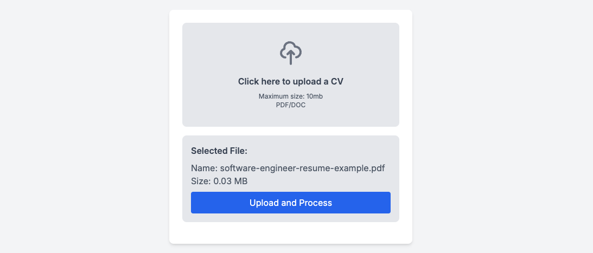

# 💼 Salary-AI-Demo

## 📝 An Educational Project Inspired by [lambda.global/talent/salary_ai](https://lambda.global/talent/salary_ai)

This project demonstrates a service similar to [lambda.global/talent/salary_ai](https://lambda.global/talent/salary_ai), showcasing AI-powered salary estimation and job recommendations.

## 🛠️ How it Works

The application analyzes uploaded CVs and uses a language model (LLM) to generate job recommendations and salary estimates. It processes the CV content, extracts key information, and matches it against job roles that fit the user's experience and skills, providing salary ranges and career suggestions based on the data.

The application leverages OpenAI embeddings and LangChain to create a semantic understanding of the CV, ensuring accurate and contextually relevant recommendations.

## 🚀 Installation

To install this project, please clone the repository and install the necessary dependencies:

```bash
git clone https://github.com/bakhbyergyen/salary-ai-demo.git
cd salary-ai-demo
yarn install
# or
npm install
# or
pnpm install
```

You will also need to set up your environment variables. An example environment file is provided as `.env.local.example`. To use it:

1. Copy the example file to create a new file:

```bash
cp .env.local.example .env.local
```

2. Add your OpenAI API key to the file:

```bash
OPENAI_API_KEY=your_api_key_here
```

⚠️ **Be careful** not to expose your OpenAI API key. This key should be kept private and not shared in public repositories or with unauthorized individuals.

## 💻 Usage

To run the application, start the development server:

```bash
yarn dev
# or
npm run dev
# or
pnpm dev
```

Open [http://localhost:3000](http://localhost:3000) in your browser to interact with the application.

### Using VSCode for Development

If you're using Visual Studio Code (VSCode), you can quickly launch the development server with the pre-configured file:

1. Open the project in VSCode.
2. Go to the **Run and Debug** section on the sidebar.
3. Select **Launch Next.js** and click the green play button.

This will start the development server on port using yarn install v1.22.19
[1/4] Resolving packages...
success Already up-to-date.
Done in 0.40s. as the package manager.

**.vscode/launch.json** configuration:

```json
{
  "version": "0.2.0",
  "configurations": [
    {
      "type": "node",
      "request": "launch",
      "name": "Launch Next.js",
      "runtimeArgs": ["run", "dev", "-p", "3000"],
      "env": {
        "NODE_ENV": "development"
      },
      "runtimeExecutable": "yarn",
      "cwd": "${workspaceFolder}",
      "console": "integratedTerminal"
    }
  ]
}
```

### Using OpenAI API for JSON-Formatted Responses

This application utilizes the function call feature of the OpenAI API to return job recommendations in a structured JSON format. Here’s how it’s done:

```javascript
const response = await openai.chat.completions.create({
  model: "gpt-4",
  messages: [
    {
      role: "system",
      content:
        "You are an insightful career advisor with a deep understanding of modern job markets and emerging career trends. Analyze the given resume and suggest suitable job positions.",
    },
    { role: "user", content: resumeText },
  ],
  functions: [
    {
      name: "provide_job_recommendations",
      description: "Provide job recommendations based on the resume",
      parameters: {
        type: "object",
        properties: {
          recommendations: {
            type: "array",
            items: {
              type: "object",
              properties: {
                title: { type: "string" },
                description: { type: "string" },
                yearsOfExperience: { type: "number" },
                suitabilityReason: { type: "string" },
                salaryRangeMNT: {
                  type: "object",
                  properties: {
                    min: { type: "number" },
                    max: { type: "number" },
                  },
                  required: ["min", "max"],
                },
              },
              required: [
                "title",
                "description",
                "yearsOfExperience",
                "suitabilityReason",
                "salaryRangeMNT",
              ],
            },
          },
          overallRecommendation: {
            type: "object",
            properties: {
              title: { type: "string" },
              reason: { type: "string" },
            },
            required: ["title", "reason"],
          },
        },
        required: ["recommendations", "overallRecommendation"],
      },
    },
  ],
  function_call: { name: "provide_job_recommendations" },
});
```

This structure allows you to get a well-formatted JSON response that includes:

- **Job Recommendations**: A list of job titles, descriptions, required years of experience, reasons for suitability, and salary ranges.
- **Overall Recommendation**: A summary of the best job fit for the user, including the title and the reason for recommendation.

## 📸 Screenshots

Below are some screenshots demonstrating the application's features:


_Screenshot 1: CV upload interface_


_Screenshot 2: Job recommendations and salary estimates_

## 🛠️ Technologies Used

This project uses the following technologies:

- **Next.js** for server-side rendering and static site generation.
- **Tailwind CSS** for styling and responsive design.
- **React Query** for managing server state and caching.
- **TypeScript** for static type checking and improved developer experience.
- **LangChain** for natural language processing (NLP) and semantic understanding.
- **OpenAI API** for generating embeddings and processing text data.

### Deployment

You can easily deploy this project to [Vercel](https://vercel.com/), which is optimized for Next.js applications:

1. Push your project to a GitHub repository.
2. Connect your repository to Vercel.
3. Deploy with a single click and get a live URL for your application.

## 🤝 Contributing

This repository is primarily for educational purposes and is not intended for further contributions. However, feel free to fork the repository and experiment with the code to better understand how AI can be integrated into web applications.

## ⚠️ Disclaimer

This demo is for educational purposes only. It is a simplified version inspired by lambda-talent-salary-ai and should not be used for actual career or financial advice.

## 📄 License

This project is licensed under the MIT License. See the [LICENSE](LICENSE) file for more details.
